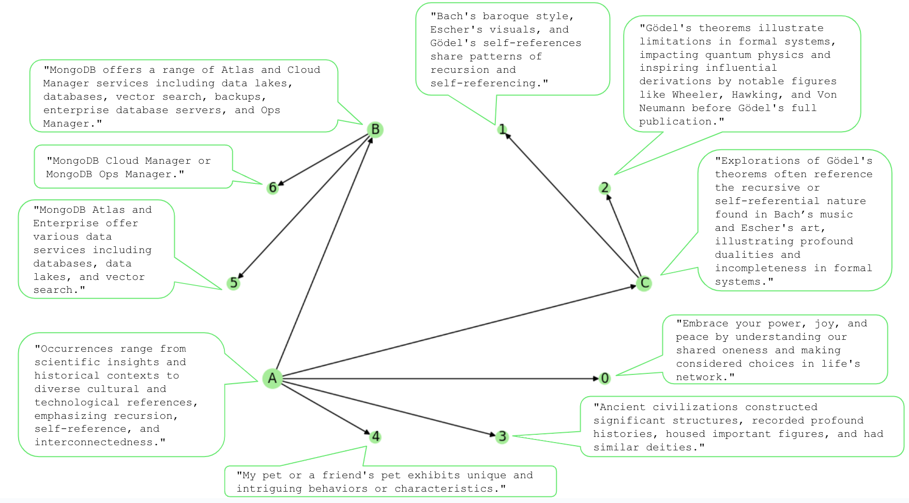

# semantic-vector-clustering

Discover the semantic structure within a cumulative vector db of embedded texts.

Demonstrates OPTICS clustering of semantic embedding vectors and centroid text generation. Features [SciKit Learn OPTICS](https://scikit-learn.org/stable/modules/generated/sklearn.cluster.OPTICS.html) clustering, [MongoDB vector dbs](https://learn.mongodb.com/learning-paths/atlas-search), OpenAI embedding and LLM with optional use of [`vec2text`](https://github.com/jxmorris12/vec2text).

Configure and run `demo_vector_clustering.py` for demo. `reverse_vector_bruteforce.py` and `reverse_vector_vec2text.py` are modules which can be also be run as stand-alone codes.

Clustering time of N vectors is O(N^2) measured at ~6 hours on Apple M2 silicon for N = 100K embedding vectors of length 1536, and ~1 hour for 60K embedding vectors of length 1536 (time_seconds = 7.6e-7 * N^2). `vec2text` works best with a non-trival number of vectors averaged to a centroid vector, and is disabled unless `CONFIGURE_VEC2TEXT = False` is set `True` in `demo_vector_clustering.py`.

No guarantees or warranties are made in this demo.

Demo semantic structure output chart, post-annotated with its LLM-generated cluster centroid texts:


```python
# Our demo input vector texts, having 5 main topics "far apart" as semantically distinct,
# where 2 topics (MongoDB items, Bach/Escher/Gödel works) are diverse enough to be
# potentially topically-split on Atlas and Gödel concepts.
# This should allow clustering at MINIMUM_VECTORS_PER_CLUSTER "granularity" of 2 or 3.
# The expected result should be 6 or 7 clusters and 2 or 3 branch/parent clusters.

TEXTS = [
    "Be at one with your power, joy and peace.",
    "Know the flow of the much greater oneness we share.",
    "Let one's superpower be considered choices in the network of life.",

    "MongoDB Ops Manager",
    "MongoDB Cloud Manager",
    "MongoDB Cloud Manager Backups",
    "MongoDB Atlas Database",
    "MongoDB Atlas Stream Processing",
    "MongoDB Atlas Vector Search",
    "MongoDB Atlas Data Lake",
    "MongoDB Enterprise Database Server",

    "Gödel, Escher, Bach: An Eternal Golden Braid",
    "How Gödel's Theorems Shape Quantum Physics as explored by Wheeler and Hawking",
    "Bach, Johann Sebastian - Six Partitas BWV 825-830 for Piano",
    "M.C. Escher, the Graphic Work",
    "Bach's baroque style features recursion or self-referencing iterated functions reminiscent of Escher's nested visuals and Gödelian self-references.",
    "In 1931, Gödel proved the profound duality that formal systems cannot be both self-consistent and complete.",
    "John Von Neumann was able to derive Gödel's 2nd theorem from his 1st before Gödel published it.",

    "My cat is a fun black and white half-sized tuxedo.",
    "Some people prefer the company of dogs instead of cats.",
    "My friend has a large saltwater aquarium with colorful and exotic tropical fish.",
    "My clever dog opens locked windows and doors to follow me.",

    "Mesopotamian tablets record a fantastic version of human history.",
    "North American burial mounds often held deceased local royal families.",
    "Mayan pyramids predated most Aztec pyramids.",
    "The Aztecs Quetzalcoatl closely resembles the Egyptian god Thoth.",
]
```

Demo semantic vector clustering output log:
```
Fitting min_vectors_per_clusters: [2]
Writing cluster data to demo_db.demo_target_vectors_fitted_semantic_clusters
Removed 26 documents in demo_db.demo_target_vectors before loading demo vectors
Loaded demo_db.demo_target_vectors with 26 demo vectors
Fetching demo_db.demo_target_vectors.embedding vectors ...
Fetched 26 vectors each length 1536, total size MB = 0.152
Clustering vectors with minimum membership = 2 ...
Elapsed time (sec) = 0.3, run_time_seconds( N ) = 0.000474 * N^2
Writing chart of clustered Semantic Structure to demo_vectors_clustered_text_2minPerCluster.png
{'_id': 0, 'L': 0, 'H': 2, 'members': 3, 'parent': 9, 'children': [], 'node_label': '0', 'node_size': 109}
{'_id': 1, 'L': 3, 'H': 5, 'members': 3, 'parent': 3, 'children': [], 'node_label': '1', 'node_size': 109}
{'_id': 2, 'L': 6, 'H': 8, 'members': 3, 'parent': 3, 'children': [], 'node_label': '2', 'node_size': 109}
{'_id': 3, 'L': 3, 'H': 9, 'members': 7, 'parent': 9, 'children': [2, 1], 'node_label': 'C', 'node_size': 194}
{'_id': 4, 'L': 10, 'H': 13, 'members': 4, 'parent': 9, 'children': [], 'node_label': '3', 'node_size': 138}
{'_id': 5, 'L': 15, 'H': 17, 'members': 3, 'parent': 9, 'children': [], 'node_label': '4', 'node_size': 109}
{'_id': 6, 'L': 18, 'H': 21, 'members': 4, 'parent': 8, 'children': [], 'node_label': '5', 'node_size': 138}
{'_id': 7, 'L': 22, 'H': 24, 'members': 3, 'parent': 8, 'children': [], 'node_label': '6', 'node_size': 109}
{'_id': 8, 'L': 18, 'H': 25, 'members': 8, 'parent': 9, 'children': [7, 6], 'node_label': 'B', 'node_size': 207}
{'_id': 9, 'L': 0, 'H': 25, 'members': 26, 'parent': None, 'children': [8, 5, 4, 3, 0], 'node_label': 'A', 'node_size': 325}
Fitted 7 centroid clusters and 3 parent clusters having >= 2 vectors, totaling 23 vectors of size = 1536
        vector index labels: [ 0  0  0  6  6  6  5 -1  5  5  5  1  2 -1  1  1  2  2  4 -1  4  4  3  3
  3  3]
        ordering: [ 0  1  2 11 14 15 12 17 16 13 22 25 24 23 19 21 18 20  6  9 10  8  4  5
  3  7]
        core_dists: [0.54732218 0.54732218 0.61317089 0.50001445 0.50001445 0.53917267
 0.56528016 0.51729891 0.51729891 0.61110531 0.63723246 0.60644374
 0.60644374 0.62035396 0.66915878 0.62051411 0.62051411 0.6207708
 0.35510193 0.35510193 0.39733506 0.412419   0.30475661 0.30475661
 0.35806351 0.45804968]
        hierarchy: [[ 0  2]
 [ 3  5]
 [ 6  8]
 [ 3  9]
 [10 13]
 [15 17]
 [18 21]
 [22 24]
 [18 25]
 [ 0 25]]
demo_db.demo_target_vectors vector cluster centroid 0, member_vectors = 3 (11.538% of population):
        vector distance = 0.325, "Be at one with your power, joy and peace."
        vector distance = 0.337, "Know the flow of the much greater oneness we share."
        vector distance = 0.373, "Let one's superpower be considered choices in the network of life."
Stored clustered vector centroid 0: Embrace your power, joy, and peace by understanding our shared oneness and making considered choices in life's network.

demo_db.demo_target_vectors vector cluster centroid 1, member_vectors = 3 (11.538% of population):
        vector distance = 0.286, "Gödel, Escher, Bach: An Eternal Golden Braid"
        vector distance = 0.316, "M.C. Escher, the Graphic Work"
        vector distance = 0.337, "Bach's baroque style features recursion or self-referencing iterated functions reminiscent of Escher's nested visuals and Gödelian self-references."
Stored clustered vector centroid 1: Bach's baroque style, Escher's visuals, and Gödel's self-references share patterns of recursion and self-referencing.

demo_db.demo_target_vectors vector cluster centroid 2, member_vectors = 3 (11.538% of population):
        vector distance = 0.339, "How Gödel's Theorems Shape Quantum Physics as explored by Wheeler and Hawking"
        vector distance = 0.312, "In 1931, Gödel proved the profound duality that formal systems cannot be both self-consistent and complete."
        vector distance = 0.306, "John Von Neumann was able to derive Gödel's 2nd theorem from his 1st before Gödel published it."
Stored clustered vector centroid 2: Gödel's theorems illustrate limitations in formal systems, impacting quantum physics and inspiring influential derivations by notable figures like Wheeler, Hawking, and Von Neumann before Gödel's full publication.

demo_db.demo_target_vectors vector cluster centroid C, member_vectors = 6 (23.077% of population):
        vector distance = 0.387, "How Gödel's Theorems Shape Quantum Physics as explored by Wheeler and Hawking"
        vector distance = 0.391, "In 1931, Gödel proved the profound duality that formal systems cannot be both self-consistent and complete."
        vector distance = 0.399, "John Von Neumann was able to derive Gödel's 2nd theorem from his 1st before Gödel published it."
        vector distance = 0.366, "Gödel, Escher, Bach: An Eternal Golden Braid"
        vector distance = 0.405, "M.C. Escher, the Graphic Work"
        vector distance = 0.391, "Bach's baroque style features recursion or self-referencing iterated functions reminiscent of Escher's nested visuals and Gödelian self-references."
Stored clustered vector centroid C: Explorations of Gödel's theorems often reference the recursive or self-referential nature found in Bach’s music and Escher's art, illustrating profound dualities and incompleteness in formal systems.

demo_db.demo_target_vectors vector cluster centroid 3, member_vectors = 4 (15.385% of population):
        vector distance = 0.400, "Mesopotamian tablets record a fantastic version of human history."
        vector distance = 0.404, "North American burial mounds often held deceased local royal families."
        vector distance = 0.374, "Mayan pyramids predated most Aztec pyramids."
        vector distance = 0.392, "The Aztecs Quetzalcoatl closely resembles the Egyptian god Thoth."
Stored clustered vector centroid 3: Ancient civilizations constructed significant structures, recorded profound histories, housed important figures, and had similar deities.

demo_db.demo_target_vectors vector cluster centroid 4, member_vectors = 3 (11.538% of population):
        vector distance = 0.348, "My cat is a fun black and white half-sized tuxedo."
        vector distance = 0.378, "My friend has a large saltwater aquarium with colorful and exotic tropical fish."
        vector distance = 0.378, "My clever dog opens locked windows and doors to follow me."
Stored clustered vector centroid 4: My pet or a friend's pet exhibits unique and intriguing behaviors or characteristics.

demo_db.demo_target_vectors vector cluster centroid 5, member_vectors = 4 (15.385% of population):
        vector distance = 0.190, "MongoDB Atlas Database"
        vector distance = 0.310, "MongoDB Atlas Vector Search"
        vector distance = 0.276, "MongoDB Atlas Data Lake"
        vector distance = 0.319, "MongoDB Enterprise Database Server"
Stored clustered vector centroid 5: MongoDB Atlas and Enterprise offer various data services including databases, data lakes, and vector search.

demo_db.demo_target_vectors vector cluster centroid 6, member_vectors = 3 (11.538% of population):
        vector distance = 0.250, "MongoDB Ops Manager"
        vector distance = 0.164, "MongoDB Cloud Manager"
        vector distance = 0.225, "MongoDB Cloud Manager Backups"
Stored clustered vector centroid 6: MongoDB Cloud Manager or MongoDB Ops Manager.

demo_db.demo_target_vectors vector cluster centroid B, member_vectors = 7 (26.923% of population):
        vector distance = 0.311, "MongoDB Ops Manager"
        vector distance = 0.266, "MongoDB Cloud Manager"
        vector distance = 0.325, "MongoDB Cloud Manager Backups"
        vector distance = 0.256, "MongoDB Atlas Database"
        vector distance = 0.372, "MongoDB Atlas Vector Search"
        vector distance = 0.330, "MongoDB Atlas Data Lake"
        vector distance = 0.311, "MongoDB Enterprise Database Server"
Stored clustered vector centroid B: MongoDB offers a range of Atlas and Cloud Manager services including data lakes, databases, vector search, backups, enterprise database servers, and Ops Manager.

demo_db.demo_target_vectors vector cluster centroid A, member_vectors = 23 (88.462% of population):
        vector distance = 0.476, "MongoDB Ops Manager"
        vector distance = 0.462, "MongoDB Cloud Manager"
        vector distance = 0.487, "MongoDB Cloud Manager Backups"
        vector distance = 0.433, "MongoDB Atlas Database"
        vector distance = 0.494, "MongoDB Atlas Vector Search"
        vector distance = 0.471, "MongoDB Atlas Data Lake"
        vector distance = 0.457, "MongoDB Enterprise Database Server"
        vector distance = 0.527, "My cat is a fun black and white half-sized tuxedo."
        vector distance = 0.533, "My friend has a large saltwater aquarium with colorful and exotic tropical fish."
        vector distance = 0.540, "My clever dog opens locked windows and doors to follow me."
        vector distance = 0.498, "Mesopotamian tablets record a fantastic version of human history."
        vector distance = 0.540, "North American burial mounds often held deceased local royal families."
        vector distance = 0.541, "Mayan pyramids predated most Aztec pyramids."
        vector distance = 0.507, "The Aztecs Quetzalcoatl closely resembles the Egyptian god Thoth."
        vector distance = 0.501, "How Gödel's Theorems Shape Quantum Physics as explored by Wheeler and Hawking"
        vector distance = 0.515, "In 1931, Gödel proved the profound duality that formal systems cannot be both self-consistent and complete."
        vector distance = 0.512, "John Von Neumann was able to derive Gödel's 2nd theorem from his 1st before Gödel published it."
        vector distance = 0.460, "Gödel, Escher, Bach: An Eternal Golden Braid"
        vector distance = 0.469, "M.C. Escher, the Graphic Work"
        vector distance = 0.491, "Bach's baroque style features recursion or self-referencing iterated functions reminiscent of Escher's nested visuals and Gödelian self-references."
        vector distance = 0.531, "Be at one with your power, joy and peace."
        vector distance = 0.501, "Know the flow of the much greater oneness we share."
        vector distance = 0.505, "Let one's superpower be considered choices in the network of life."
Stored clustered vector centroid A: Occurrences range from scientific insights and historical contexts to diverse cultural and technological references, emphasizing recursion, self-reference, and interconnectedness.

done
```

Demo-discovered semantic centroids and generated centroid texts:
```javascript
demo_db> db.demo_target_vectors_fitted_semantic_clusters.find({},{centroid_embedding:0,_id:0});
[
  {
    metadata: 'clustered text centroid',
    min_vectors_per_cluster: 2,
    centroid_label: '0',
    centroid_std_error: 0.025506040081381798,
    centroid_text_LLM_merged: "Embrace your power, joy, and peace by understanding our shared oneness and making considered choices in life's network.",
    clustered_members: 3,
    rejected_members: 0,
    centroid_texts: [
      'Be at one with your power, joy and peace.',
      'Know the flow of the much greater oneness we share.',
      "Let one's superpower be considered choices in the network of life."
    ]
  },
  {
    metadata: 'clustered text centroid',
    min_vectors_per_cluster: 2,
    centroid_label: '1',
    centroid_std_error: 0.025504982098937035,
    centroid_text_LLM_merged: "Bach's baroque style, Escher's visuals, and Gödel's self-references share patterns of recursion and self-referencing.",
    clustered_members: 3,
    rejected_members: 0,
    centroid_texts: [
      "Bach's baroque style features recursion or self-referencing iterated functions reminiscent of Escher's nested visuals and Gödelian self-references.",
      'Gödel, Escher, Bach: An Eternal Golden Braid',
      'M.C. Escher, the Graphic Work'
    ]
  },
  {
    metadata: 'clustered text centroid',
    min_vectors_per_cluster: 2,
    centroid_label: '2',
    centroid_std_error: 0.025506900623440742,
    centroid_text_LLM_merged: "Gödel's theorems illustrate limitations in formal systems, impacting quantum physics and inspiring influential derivations by notable figures like Wheeler, Hawking, and Von Neumann before Gödel's full publication.",
    clustered_members: 3,
    rejected_members: 0,
    centroid_texts: [
      "How Gödel's Theorems Shape Quantum Physics as explored by Wheeler and Hawking",
      'In 1931, Gödel proved the profound duality that formal systems cannot be both self-consistent and complete.',
      "John Von Neumann was able to derive Gödel's 2nd theorem from his 1st before Gödel published it."
    ]
  },
  {
    metadata: 'clustered text centroid',
    min_vectors_per_cluster: 2,
    centroid_label: 'C',
    centroid_std_error: 0.02550596371293068,
    centroid_text_LLM_merged: "Explorations of Gödel's theorems often reference the recursive or self-referential nature found in Bach’s music and Escher's art, illustrating profound dualities and incompleteness in formal systems.",
    clustered_members: 6,
    rejected_members: 0,
    centroid_texts: [
      "Bach's baroque style features recursion or self-referencing iterated functions reminiscent of Escher's nested visuals and Gödelian self-references.",
      'Gödel, Escher, Bach: An Eternal Golden Braid',
      "How Gödel's Theorems Shape Quantum Physics as explored by Wheeler and Hawking",
      'In 1931, Gödel proved the profound duality that formal systems cannot be both self-consistent and complete.',
      "John Von Neumann was able to derive Gödel's 2nd theorem from his 1st before Gödel published it.",
      'M.C. Escher, the Graphic Work'
    ]
  },
  {
    metadata: 'clustered text centroid',
    min_vectors_per_cluster: 2,
    centroid_label: '3',
    centroid_std_error: 0.02550589106976986,
    centroid_text_LLM_merged: 'Ancient civilizations constructed significant structures, recorded profound histories, housed important figures, and had similar deities.',
    clustered_members: 4,
    rejected_members: 0,
    centroid_texts: [
      'Mayan pyramids predated most Aztec pyramids.',
      'Mesopotamian tablets record a fantastic version of human history.',
      'North American burial mounds often held deceased local royal families.',
      'The Aztecs Quetzalcoatl closely resembles the Egyptian god Thoth.'
    ]
  },
  {
    metadata: 'clustered text centroid',
    min_vectors_per_cluster: 2,
    centroid_label: '4',
    centroid_std_error: 0.025506218895316124,
    centroid_text_LLM_merged: "My pet or a friend's pet exhibits unique and intriguing behaviors or characteristics.",
    clustered_members: 3,
    rejected_members: 0,
    centroid_texts: [
      'My cat is a fun black and white half-sized tuxedo.',
      'My clever dog opens locked windows and doors to follow me.',
      'My friend has a large saltwater aquarium with colorful and exotic tropical fish.'
    ]
  },
  {
    metadata: 'clustered text centroid',
    min_vectors_per_cluster: 2,
    centroid_label: '5',
    centroid_std_error: 0.02550419233739376,
    centroid_text_LLM_merged: 'MongoDB Atlas and Enterprise offer various data services including databases, data lakes, and vector search.',
    clustered_members: 4,
    rejected_members: 0,
    centroid_texts: [
      'MongoDB Atlas Data Lake',
      'MongoDB Atlas Database',
      'MongoDB Atlas Vector Search',
      'MongoDB Enterprise Database Server'
    ]
  },
  {
    metadata: 'clustered text centroid',
    min_vectors_per_cluster: 2,
    centroid_label: '6',
    centroid_std_error: 0.025503886863589287,
    centroid_text_LLM_merged: 'MongoDB Cloud Manager or MongoDB Ops Manager.',
    clustered_members: 3,
    rejected_members: 0,
    centroid_texts: [
      'MongoDB Cloud Manager',
      'MongoDB Cloud Manager Backups',
      'MongoDB Ops Manager'
    ]
  },
  {
    metadata: 'clustered text centroid',
    min_vectors_per_cluster: 2,
    centroid_label: 'B',
    centroid_std_error: 0.025504061952233315,
    centroid_text_LLM_merged: 'MongoDB offers a range of Atlas and Cloud Manager services including data lakes, databases, vector search, backups, enterprise database servers, and Ops Manager.',
    clustered_members: 7,
    rejected_members: 0,
    centroid_texts: [
      'MongoDB Atlas Data Lake',
      'MongoDB Atlas Database',
      'MongoDB Atlas Vector Search',
      'MongoDB Cloud Manager',
      'MongoDB Cloud Manager Backups',
      'MongoDB Enterprise Database Server',
      'MongoDB Ops Manager'
    ]
  },
  {
    metadata: 'clustered text centroid',
    min_vectors_per_cluster: 2,
    centroid_label: 'A',
    centroid_std_error: 0.025505434721708298,
    centroid_text_LLM_merged: 'Occurrences range from scientific insights and historical contexts to diverse cultural and technological references, emphasizing recursion, self-reference, and interconnectedness.',
    clustered_members: 23,
    rejected_members: 0,
    centroid_texts: [
      "Bach's baroque style features recursion or self-referencing iterated functions reminiscent of Escher's nested visuals and Gödelian self-references.",
      'Be at one with your power, joy and peace.',
      'Gödel, Escher, Bach: An Eternal Golden Braid',
      "How Gödel's Theorems Shape Quantum Physics as explored by Wheeler and Hawking",
      'In 1931, Gödel proved the profound duality that formal systems cannot be both self-consistent and complete.',
      "John Von Neumann was able to derive Gödel's 2nd theorem from his 1st before Gödel published it.",
      'Know the flow of the much greater oneness we share.',
      "Let one's superpower be considered choices in the network of life.",
      'M.C. Escher, the Graphic Work',
      'Mayan pyramids predated most Aztec pyramids.',
      'Mesopotamian tablets record a fantastic version of human history.',
      'MongoDB Atlas Data Lake',
      'MongoDB Atlas Database',
      'MongoDB Atlas Vector Search',
      'MongoDB Cloud Manager',
      'MongoDB Cloud Manager Backups',
      'MongoDB Enterprise Database Server',
      'MongoDB Ops Manager',
      'My cat is a fun black and white half-sized tuxedo.',
      'My clever dog opens locked windows and doors to follow me.',
      'My friend has a large saltwater aquarium with colorful and exotic tropical fish.',
      'North American burial mounds often held deceased local royal families.',
      'The Aztecs Quetzalcoatl closely resembles the Egyptian god Thoth.'
    ]
  }
]
```